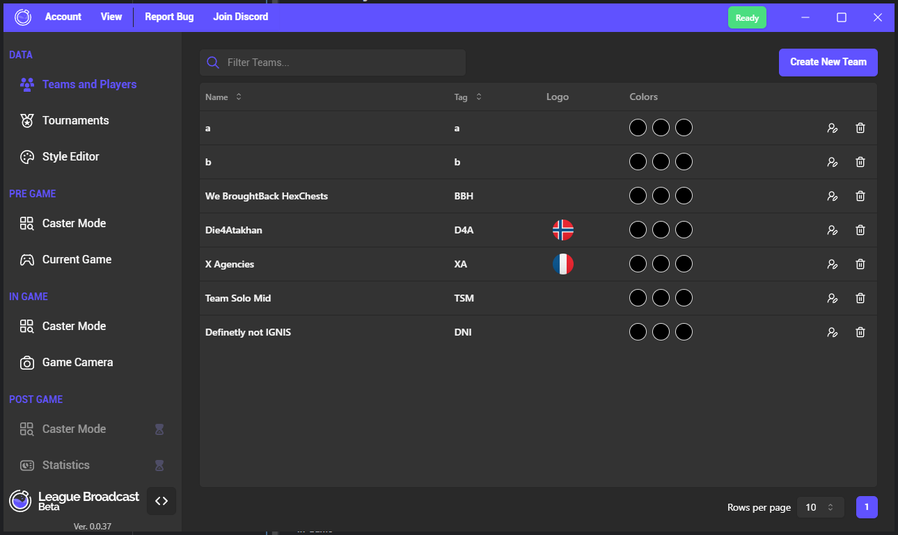
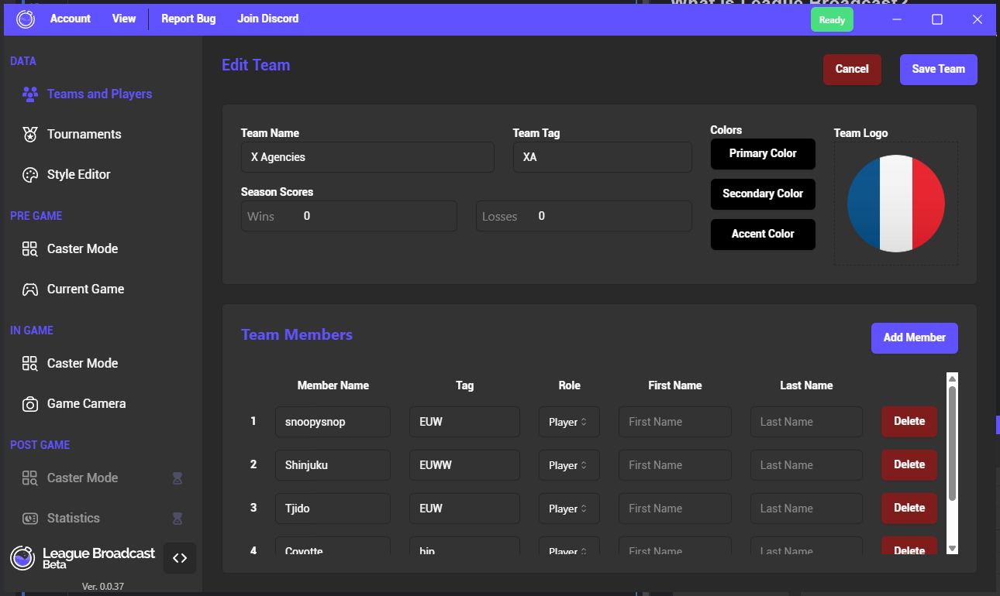

> ⚠️ This tutorial isn't endorsed by Blue Bottle.  

> ℹ️ It's just a gathering of knowledge so that new and not-so-new people can learn or pool their knowledge together.  
___

# League Broadcast

## Summary

## What is League Broadcast?

League Broadcast, or LB in short, is a software application that enhances League of Legends' spectator mode.

* [**Visit their website.**](https://bluebottle.gg/) 
* [**Visit their Discord server.**](https://discord.com/invite/kk7RGds5XS) 

## How their tools work

This is not the point of this tutorial.

## Setup

The download link is available directly on their site. 
I'm not going to give you a link that may evolve or be out of date.

## Software Introduction

### Data

This section deals with the configuration of your datasets.

#### Teams and Players

Use this page to configure your teams. 

For each team, you can configure a set of elements such as name, abbreviation, logo and colors. 

#### Tournaments

#### Style Editor

### Pre Game

#### Caster Mode

#### Current Game

### In Game

#### Caster Mode

#### Game Camera 

### Post Game

However, few sneak previews were presented on the discord : [🔗 Discord Link - Overlay Sneak Peek](https://discord.com/channels/1139241559385198593/1312889544659566592/1382356638152790118)

#### Caster Mode

#### Statistics

## First Steps

The examples below are based on OBS Studio software. 

### 

